# UML to OPC UA Model Transformation Rules

## QVTo configuration options

Configuration options can be set via the file transforms/Common/Configuration.qvto.

| Parameter                      | Type    | Description                                                  |
| ------------------------------ | ------- | ------------------------------------------------------------ |
| CFG_ENABLE_ALIAS_TABLE         | Boolean | Enable/Disable creation of the OPCUA::AliasTable             |
| CFG_USE_BLACKBOX               | Boolean | Enable/Disable use of the QVTo Blackbox. The Blackbox allows to read NodeIds from a NodeId CSV file instead of defining them statically as part of the transformation. |
| CFG_GENERATE_TRANSITION_EVENTS | Boolean | Enable/Disable generation of HasEffect TransitionEventType for all state transitions. |

## Nomenclature

UML and OPC UA often share the same nomenclature. To avoid confusion, UML::SomeElement referes to SomeElement in UML, not necessarily a meta-model element. Likewise, OPCUA::SomeElement refers to SomeElement in the OPCUA.

A statement like "An OPCUA::Transition..." is used equivalent to "An object of type OPCUA::TransitionType...".

## General information about the transformation rules

#### Namespace management

Any UML::Element has to be assigned to a namespace in OPC UA by the transformation process. This is absolutely mandatory, as OPC UA elements cannot exist without a namespace. Namespaces in an OPC UA information model are organized using the OPCUA::UANodeSet::NamespaceUris table. 

Namespace 0 is reserved for the OPC UA Base Information Model. Thus, the first entry in the OPCUA::UANodeSet::NamespaceUris table has the namespace index 1. The namespace with index 1 is also referred to as default namespace.

Any UML::Element can be assigned to a namespace by placing it in a UML::Package. If a UML::Element is not placed in a UML::Package, the default namespace will be used.

###### Namespace definition using packages

UML::Packages can be used to define the Namespace of multiple UML elements.

The UML::Package::URI will be used as namespace. If no UML::Package::URI is defined, the Package::name will be used instead.

###### Default namespace

If the UML::Element is not part of a UML::Package, the UML::Model::URI is used as default namespace. 

If no UML::Model::URI is specified, the UML::Model::name will be used instead.

If no UML::Model::name is specified, the transformation process will throw and exception and terminate.

#### OPCUA::NamespaceUris

An OPCUA:NamespaceUris table is generated automatically for all namespaces that are used by the OPC UA model.

#### OPCUA::AliasTable

The OPCUA::AliasTable allows to use human-readable identifiers in the Nodeset file, e.g., BaseObjectType instead of i=58. If CFG_ENABLE_ALIAS_TABLE = true, the human-readable format will be used where possible. This results in a larger Nodeset file.

#### OPCUA::NodeId format

The transformation currently generates String NodeIds of the Format "ns=NAMESPACE_INDEX;s=IDENTIFIER".

#### OPCUA::Browsename, OPCUA::Displayname

The Browsename is always equal to the Displayname. Both are derived from the UML::name attribute, if not stated otherwise in each of the transformation rules.

## Class diagram transformation rules

#### Basic example: Robots class diagram

###### Graphical representation

|                           UML                            |                           OPC UA                            |
| :------------------------------------------------------: | :---------------------------------------------------------: |
|  |  |


#### UML::Class

###### Notes

- "Type" is appended to Class.name and used as OPCUA::Browsename, OPCUA::Displayname, and IDENTIFIER for the NodeId.
- OPCUA::BaseObjectType is used as a supertype, if no other generalization is specified for the class.

###### Graphical representation

|                    UML                     |                          OPC UA                           |
| :----------------------------------------: | :-------------------------------------------------------: |
| 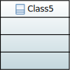 | 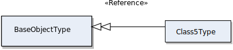 |

###### UML

```xml
<packagedElement xmi:type="uml:Class" xmi:id="_punesMdPEeqBwPQ5-6UCwg" name="Class5"/>
```

###### OPC UA

```xml
<UAObjectType BrowseName="Class5Type" NodeId="ns=1;s=Class5Type">
  <DisplayName>Class5Type</DisplayName>
  <References>
    <Reference IsForward="false" ReferenceType="HasSubtype">BaseObjectType</Reference>
  </References>
</UAObjectType>
```


#### UML::Package

###### Notes

- UML::Elements can be put into UML::Packages to assign them to different namespaces.

###### Graphical representation

|                      UML                      |                            OPC UA                            |
| :-------------------------------------------: | :----------------------------------------------------------: |
| 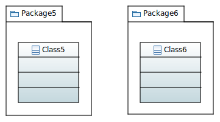 | There is currently no graphical representation of packages in OPC UA. |

###### UML

```xml
<packagedElement xmi:type="uml:Package" xmi:id="_TawroAGmEeuUI-nHHyWhEQ" name="Package5" URI="http://auto.tuwien.ac.at/Package5">
  <packagedElement xmi:type="uml:Class" xmi:id="_SyVYkP5XEeqcH6exUiFZNQ" name="Class5"/>
</packagedElement>
<packagedElement xmi:type="uml:Package" xmi:id="_ztmqUC8sEeuNUsVP4bhZkg" name="Package6" URI="http://auto.tuwien.ac.at/Package6">
  <packagedElement xmi:type="uml:Class" xmi:id="_3hr_8C8sEeuNUsVP4bhZkg" name="Class6"/>
</packagedElement>
```

###### OPC UA

```xml
<NamespaceUris>
  <Uri>http://auto.tuwien.ac.at/Package5</Uri>
  <Uri>http://auto.tuwien.ac.at/Package6</Uri>
</NamespaceUris>
<UAObjectType BrowseName="Class6Type" NodeId="ns=1;s=Class6Type">
  <DisplayName>Class6Type</DisplayName>
  <References>
    <Reference IsForward="false" ReferenceType="HasSubtype">BaseObjectType</Reference>
  </References>
</UAObjectType>
<UAObjectType BrowseName="Class5Type" NodeId="ns=2;s=Class5Type">
  <DisplayName>Class5Type</DisplayName>
  <References>
    <Reference IsForward="false" ReferenceType="HasSubtype">BaseObjectType</Reference>
  </References>
</UAObjectType>
```


#### UML::Property

###### Notes

- Supported primitive types (UML::PrimitiveType --> OPCUA::DataType)
  - String --> String
  - Integer --> Int32
  - Real --> Double
  - Float --> Double
  - Boolean --> Boolean
- The example shown below illustrates the transformation rule for data type String.

###### Graphical representation

|                         UML                         |                            OPC UA                            |
| :-------------------------------------------------: | :----------------------------------------------------------: |
| 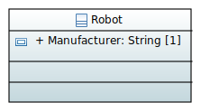 | 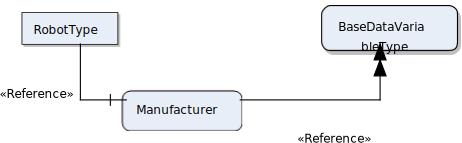 |

###### UML

```xml
<packagedElement xmi:type="uml:Class" xmi:id="_punesMdPEeqBwPQ5-6UCwg" name="Robot">
  <ownedAttribute xmi:type="uml:Property" xmi:id="_yDe34MdPEeqBwPQ5-6UCwg" name="Manufacturer">
    <type xmi:type="uml:PrimitiveType" href="pathmap://UML_LIBRARIES/UMLPrimitiveTypes.library.uml#String"/>
  </ownedAttribute>
</packagedElement>
```

###### OPC UA

```xml
<UAVariable BrowseName="Manufacturer" NodeId="ns=1;s=Manufacturer" ParentNodeId="ns=1;s=RobotType" DataType="String">
  <DisplayName>Manufacturer</DisplayName>
  <References>
    <Reference ReferenceType="HasTypeDefinition">BaseDataVariableType</Reference>
    <Reference ReferenceType="HasModellingRule">ModellingRule_Mandatory</Reference>
    <Reference IsForward="false" ReferenceType="HasComponent">ns=1;s=RobotType</Reference>
  </References>
</UAVariable>
<UAObjectType BrowseName="RobotType" NodeId="ns=1;s=RobotType">
  <DisplayName>RobotType</DisplayName>
  <References>
    <Reference IsForward="false" ReferenceType="HasSubtype">BaseObjectType</Reference>
    <Reference ReferenceType="HasComponent">ns=1;s=Manufacturer</Reference>
  </References>
</UAObjectType>
```


#### UML::Operation

###### Notes

- Multiple input arguments and one output argument is supported
- The same data types as for UML::Property are supported

###### Graphical representation

|                      UML                       |                            OPC UA                            |
| :--------------------------------------------: | :----------------------------------------------------------: |
| 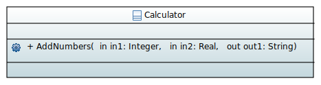 | 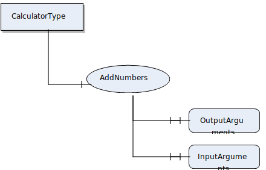 |

###### UML

```xml
<packagedElement xmi:type="uml:Class" xmi:id="_xmRqIOeeEeqjR_xlvLGirg" name="Calculator">
  <ownedOperation xmi:type="uml:Operation" xmi:id="_0K7_QOeeEeqjR_xlvLGirg" name="AddNumbers">
    <ownedParameter xmi:type="uml:Parameter" xmi:id="_EuzaMOefEeqjR_xlvLGirg" name="in1">
      <type xmi:type="uml:PrimitiveType" href="pathmap://UML_LIBRARIES/UMLPrimitiveTypes.library.uml#Integer"/>
    </ownedParameter>
    <ownedParameter xmi:type="uml:Parameter" xmi:id="_AXyDsP2lEeqtk8EiRXAc9A" name="in2">
      <type xmi:type="uml:PrimitiveType" href="pathmap://UML_LIBRARIES/UMLPrimitiveTypes.library.uml#Real"/>
    </ownedParameter>
    <ownedParameter xmi:type="uml:Parameter" xmi:id="_HangMOefEeqjR_xlvLGirg" name="out1" direction="out">
      <type xmi:type="uml:PrimitiveType" href="pathmap://UML_LIBRARIES/UMLPrimitiveTypes.library.uml#String"/>
    </ownedParameter>
  </ownedOperation>
</packagedElement>
```

###### OPC UA

```xml
<UAVariable BrowseName="InputArguments" NodeId="ns=1;s=AddNumbersInputArguments" ParentNodeId="ns=1;s=AddNumbers" ArrayDimensions="3" DataType="Argument" ValueRank="1">
  <DisplayName>InputArguments</DisplayName>
  <References>
    <Reference ReferenceType="HasModellingRule">ModellingRule_Mandatory</Reference>
    <Reference IsForward="false" ReferenceType="HasComponent">ns=1;s=AddNumbers</Reference>
    <Reference ReferenceType="HasTypeDefinition">PropertyType</Reference>
  </References>
  <Value>
    <types:ListOfExtensionObject>
      <types:ExtensionObject>
        <types:TypeId>
          <types:Identifier>Argument_Encoding_DefaultXml</types:Identifier>
        </types:TypeId>
        <types:Body>
          <types:Argument>
            <types:Name>in2</types:Name>
            <types:DataType>
              <types:Identifier>Double</types:Identifier>
            </types:DataType>
            <types:ValueRank>-1</types:ValueRank>
          </types:Argument>
        </types:Body>
      </types:ExtensionObject>
      <types:ExtensionObject>
        <types:TypeId>
          <types:Identifier>Argument_Encoding_DefaultXml</types:Identifier>
        </types:TypeId>
        <types:Body>
          <types:Argument>
            <types:Name>in1</types:Name>
            <types:DataType>
              <types:Identifier>Int32</types:Identifier>
            </types:DataType>
            <types:ValueRank>-1</types:ValueRank>
          </types:Argument>
        </types:Body>
      </types:ExtensionObject>
    </types:ListOfExtensionObject>
  </Value>
</UAVariable>
<UAVariable BrowseName="OutputArguments" NodeId="ns=1;s=AddNumbersOutputArguments" ParentNodeId="ns=1;s=AddNumbers" ArrayDimensions="3" DataType="Argument" ValueRank="1">
  <DisplayName>OutputArguments</DisplayName>
  <References>
    <Reference ReferenceType="HasModellingRule">ModellingRule_Mandatory</Reference>
    <Reference IsForward="false" ReferenceType="HasComponent">ns=1;s=AddNumbers</Reference>
    <Reference ReferenceType="HasTypeDefinition">PropertyType</Reference>
  </References>
  <Value>
    <types:ListOfExtensionObject>
      <types:ExtensionObject>
        <types:TypeId>
          <types:Identifier>Argument_Encoding_DefaultXml</types:Identifier>
        </types:TypeId>
        <types:Body>
          <types:Argument>
            <types:Name>out1</types:Name>
            <types:DataType>
              <types:Identifier>String</types:Identifier>
            </types:DataType>
            <types:ValueRank>-1</types:ValueRank>
          </types:Argument>
        </types:Body>
      </types:ExtensionObject>
    </types:ListOfExtensionObject>
  </Value>
</UAVariable>
<UAMethod BrowseName="AddNumbers" NodeId="ns=1;s=AddNumbers" ParentNodeId="ns=1;s=CalculatorType">
  <DisplayName>AddNumbers</DisplayName>
  <References>
    <Reference ReferenceType="HasModellingRule">ModellingRule_Mandatory</Reference>
    <Reference IsForward="false" ReferenceType="HasComponent">ns=1;s=CalculatorType</Reference>
    <Reference ReferenceType="HasProperty">ns=1;s=AddNumbersInputArguments</Reference>
    <Reference ReferenceType="HasProperty">ns=1;s=AddNumbersOutputArguments</Reference>
  </References>
</UAMethod>
<UAObjectType BrowseName="CalculatorType" NodeId="ns=1;s=CalculatorType">
  <DisplayName>CalculatorType</DisplayName>
  <References>
    <Reference IsForward="false" ReferenceType="HasSubtype">BaseObjectType</Reference>
    <Reference ReferenceType="HasComponent">ns=1;s=AddNumbers</Reference>
  </References>
</UAObjectType>
```


#### UML::Generalization

###### Notes

- Only single inheritance is supported

###### Graphical representation

|                         UML                         |                            OPC UA                            |
| :-------------------------------------------------: | :----------------------------------------------------------: |
| 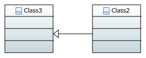 | 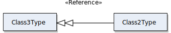 |

###### UML

```xml
<packagedElement xmi:type="uml:Class" xmi:id="_bjo7UP5FEeqcH6exUiFZNQ" name="Class2">
  <generalization xmi:type="uml:Generalization" xmi:id="_HqEJsAIzEeuH6ovpu80iPw" general="_cGH9UP5FEeqcH6exUiFZNQ"/>
</packagedElement>
<packagedElement xmi:type="uml:Class" xmi:id="_cGH9UP5FEeqcH6exUiFZNQ" name="Class3"/>
```

###### OPC UA

```xml
<UAObjectType BrowseName="Class3Type" NodeId="ns=1;s=Class3Type">
  <DisplayName>Class3Type</DisplayName>
  <References>
    <Reference IsForward="false" ReferenceType="HasSubtype">BaseObjectType</Reference>
  </References>
</UAObjectType>
<UAObjectType BrowseName="Class2Type" NodeId="ns=1;s=Class2Type">
  <DisplayName>Class2Type</DisplayName>
  <References>
    <Reference IsForward="false" ReferenceType="HasSubtype">ns=1;s=Class3Type</Reference>
  </References>
</UAObjectType>
```


#### UML::Composition

###### Notes

- If no name for the referenced Object is specified via UML::Property.name (ControllerX in the example below), the name of the resulting OPCUA::Object will be autogenerated from referenced class name.

###### Graphical representation

|                             UML                              |                            OPC UA                            |
| :----------------------------------------------------------: | :----------------------------------------------------------: |
| 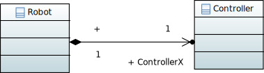 | 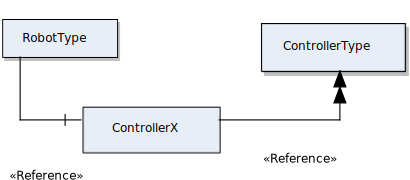 |

###### UML

```xml
<packagedElement xmi:type="uml:Class" xmi:id="_bjo7UP5FEeqcH6exUiFZNQ" name="Robot">
  <ownedAttribute xmi:type="uml:Property" xmi:id="_iUI-wP5FEeqcH6exUiFZNQ" name="ControllerX" type="_cGH9UP5FEeqcH6exUiFZNQ" aggregation="composite" association="_iUAb4P5FEeqcH6exUiFZNQ"/>
</packagedElement>
<packagedElement xmi:type="uml:Class" xmi:id="_cGH9UP5FEeqcH6exUiFZNQ" name="Controller"/>
<packagedElement xmi:type="uml:Association" xmi:id="_iUAb4P5FEeqcH6exUiFZNQ" visibility="public" memberEnd="_iUI-wP5FEeqcH6exUiFZNQ _iUNQMf5FEeqcH6exUiFZNQ">
  <eAnnotations xmi:type="ecore:EAnnotation" xmi:id="_iUDfMP5FEeqcH6exUiFZNQ" source="org.eclipse.papyrus">
    <details xmi:type="ecore:EStringToStringMapEntry" xmi:id="_iUEGQP5FEeqcH6exUiFZNQ" key="nature" value="UML_Nature"/>
  </eAnnotations>
  <ownedEnd xmi:type="uml:Property" xmi:id="_iUNQMf5FEeqcH6exUiFZNQ" type="_bjo7UP5FEeqcH6exUiFZNQ" association="_iUAb4P5FEeqcH6exUiFZNQ"/>
</packagedElement>
```

###### OPC UA

```xml
<UAObject BrowseName="ControllerX" NodeId="ns=1;s=ControllerX" ParentNodeId="ns=1;s=RobotType">
  <DisplayName>ControllerX</DisplayName>
  <References>
    <Reference ReferenceType="HasTypeDefinition">ns=1;s=ControllerType</Reference>
    <Reference IsForward="false" ReferenceType="HasComponent">ns=1;s=RobotType</Reference>
    <Reference ReferenceType="HasModellingRule">ModellingRule_Mandatory</Reference>
  </References>
</UAObject>
<UAObjectType BrowseName="ControllerType" NodeId="ns=1;s=ControllerType">
  <DisplayName>ControllerType</DisplayName>
  <References>
    <Reference IsForward="false" ReferenceType="HasSubtype">BaseObjectType</Reference>
  </References>
</UAObjectType>
<UAObjectType BrowseName="RobotType" NodeId="ns=1;s=RobotType">
  <DisplayName>RobotType</DisplayName>
  <References>
    <Reference IsForward="false" ReferenceType="HasSubtype">BaseObjectType</Reference>
    <Reference ReferenceType="HasComponent">ns=1;s=ControllerX</Reference>
  </References>
</UAObjectType>
```


#### UML::Aggregation

###### Notes

- UML::Aggregation is handled exactly as UML::Composition.

###### Graphical representation

|                       UML                        |                            OPC UA                            |
| :----------------------------------------------: | :----------------------------------------------------------: |
| 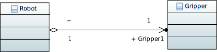 | 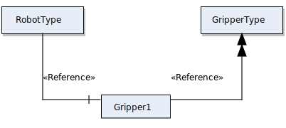 |

###### UML

```xml
<packagedElement xmi:type="uml:Class" xmi:id="_bjo7UP5FEeqcH6exUiFZNQ" name="Robot">
  <ownedAttribute xmi:type="uml:Property" xmi:id="_iSqtMv5HEeqcH6exUiFZNQ" name="Gripper1" type="_cGH9UP5FEeqcH6exUiFZNQ" aggregation="shared" association="_iSpfEP5HEeqcH6exUiFZNQ"/>
</packagedElement>
<packagedElement xmi:type="uml:Class" xmi:id="_cGH9UP5FEeqcH6exUiFZNQ" name="Gripper"/>
<packagedElement xmi:type="uml:Association" xmi:id="_iSpfEP5HEeqcH6exUiFZNQ" memberEnd="_iSqtMv5HEeqcH6exUiFZNQ _iSr7UP5HEeqcH6exUiFZNQ">
  <eAnnotations xmi:type="ecore:EAnnotation" xmi:id="_iSqtMP5HEeqcH6exUiFZNQ" source="org.eclipse.papyrus">
    <details xmi:type="ecore:EStringToStringMapEntry" xmi:id="_iSqtMf5HEeqcH6exUiFZNQ" key="nature" value="UML_Nature"/>
  </eAnnotations>
  <ownedEnd xmi:type="uml:Property" xmi:id="_iSr7UP5HEeqcH6exUiFZNQ" type="_bjo7UP5FEeqcH6exUiFZNQ" association="_iSpfEP5HEeqcH6exUiFZNQ"/>
</packagedElement>
```

###### OPC UA

```xml
<UAObject BrowseName="Gripper1" NodeId="ns=1;s=Gripper1" ParentNodeId="ns=1;s=RobotType">
  <DisplayName>Gripper1</DisplayName>
  <References>
    <Reference ReferenceType="HasTypeDefinition">ns=1;s=GripperType</Reference>
    <Reference IsForward="false" ReferenceType="HasComponent">ns=1;s=RobotType</Reference>
    <Reference ReferenceType="HasModellingRule">ModellingRule_Mandatory</Reference>
  </References>
</UAObject>
<UAObjectType BrowseName="RobotType" NodeId="ns=1;s=RobotType">
  <DisplayName>RobotType</DisplayName>
  <References>
    <Reference IsForward="false" ReferenceType="HasSubtype">BaseObjectType</Reference>
    <Reference ReferenceType="HasComponent">ns=1;s=Gripper1</Reference>
  </References>
</UAObjectType>
<UAObjectType BrowseName="GripperType" NodeId="ns=1;s=GripperType">
  <DisplayName>GripperType</DisplayName>
  <References>
    <Reference IsForward="false" ReferenceType="HasSubtype">BaseObjectType</Reference>
  </References>
</UAObjectType>
```


#### UML::Multiplicities

###### Notes

- It is assumed that source of the reference has multiplicity 1. Supported multiplicities for destination (UML --> OPC UA):
  - 0..1 --> ModellingRule_Optional
  - 1..1 --> ModellingRule_Mandatory
  - 0..* / * --> ModellingRule_OptionalPlaceholder
  - 1..* / + --> ModellingRule_MandatoryPlaceholder
  - n..m --> not supported
- The example shown below illustrates the transformation rule for multiplicity 1..* .

###### Graphical representation

|                            UML                            |                            OPC UA                            |
| :-------------------------------------------------------: | :----------------------------------------------------------: |
| 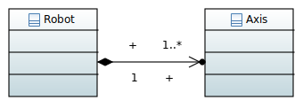 | 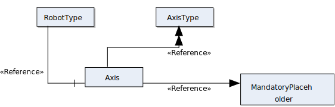 |

###### UML

```xml
<packagedElement xmi:type="uml:Class" xmi:id="_bjo7UP5FEeqcH6exUiFZNQ" name="Robot">
  <ownedAttribute xmi:type="uml:Property" xmi:id="_iSqtMv5HEeqcH6exUiFZNQ" type="_cGH9UP5FEeqcH6exUiFZNQ" aggregation="composite" association="_iSpfEP5HEeqcH6exUiFZNQ">
    <upperValue xmi:type="uml:LiteralUnlimitedNatural" xmi:id="_iSrUQf5HEeqcH6exUiFZNQ" value="*"/>
  </ownedAttribute>
</packagedElement>
<packagedElement xmi:type="uml:Class" xmi:id="_cGH9UP5FEeqcH6exUiFZNQ" name="Axis"/>
<packagedElement xmi:type="uml:Association" xmi:id="_iSpfEP5HEeqcH6exUiFZNQ" memberEnd="_iSqtMv5HEeqcH6exUiFZNQ _iSr7UP5HEeqcH6exUiFZNQ">
  <eAnnotations xmi:type="ecore:EAnnotation" xmi:id="_iSqtMP5HEeqcH6exUiFZNQ" source="org.eclipse.papyrus">
    <details xmi:type="ecore:EStringToStringMapEntry" xmi:id="_iSqtMf5HEeqcH6exUiFZNQ" key="nature" value="UML_Nature"/>
  </eAnnotations>
  <ownedEnd xmi:type="uml:Property" xmi:id="_iSr7UP5HEeqcH6exUiFZNQ" type="_bjo7UP5FEeqcH6exUiFZNQ" association="_iSpfEP5HEeqcH6exUiFZNQ"/>
</packagedElement>
```

###### OPC UA

```xml
<UAObject xsi:type="UAObject" BrowseName="Axis" NodeId="ns=1;s=Axis" ParentNodeId="ns=1;s=RobotType">
  <DisplayName xsi:type="LocalizedText">Axis</DisplayName>
  <References xsi:type="ListOfReferences">
    <Reference xsi:type="Reference" ReferenceType="HasTypeDefinition">ns=1;s=AxisType</Reference>
    <Reference xsi:type="Reference" IsForward="false" ReferenceType="HasComponent">ns=1;s=RobotType</Reference>
    <Reference xsi:type="Reference" ReferenceType="HasModellingRule">ModellingRule_MandatoryPlaceholder</Reference>
  </References>
</UAObject>
<UAObjectType xsi:type="UAObjectType" BrowseName="AxisType" NodeId="ns=1;s=AxisType">
  <DisplayName xsi:type="LocalizedText">AxisType</DisplayName>
  <References xsi:type="ListOfReferences">
    <Reference xsi:type="Reference" IsForward="false" ReferenceType="HasSubtype">BaseObjectType</Reference>
  </References>
</UAObjectType>
<UAObjectType xsi:type="UAObjectType" BrowseName="RobotType" NodeId="ns=1;s=RobotType">
  <DisplayName xsi:type="LocalizedText">RobotType</DisplayName>
  <References xsi:type="ListOfReferences">
    <Reference xsi:type="Reference" IsForward="false" ReferenceType="HasSubtype">BaseObjectType</Reference>
    <Reference xsi:type="Reference" ReferenceType="HasComponent">ns=1;s=Axis</Reference>
  </References>
</UAObjectType>
```


## State machine diagram transformation rules

#### Quick reference

| UML               | OPC UA                                                       |
| ----------------- | ------------------------------------------------------------ |
| UML::StateMachine | ObjectType which is Subtype of StateMachineType, the parent type shall be referenced via class diagram |
| UML::Region       | No equivalent.                                               |
| UML::Pseudostate  | OPCUA::InitialStateType                                      |
| UML::State        | OPCUA::StateType                                             |
| UML::Transition   | OPCUA::StateTransitionType                                   |
| ...               | ...                                                          |


#### UML::StateMachine

###### Notes

- An UML::StateMachine are transformed to OPCUA::StateMachine with supertype OPCUA::FiniteStateMachineType.

###### Graphical representation

|                             UML                              |                            OPC UA                            |
| :----------------------------------------------------------: | :----------------------------------------------------------: |
| 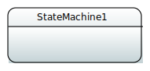 | 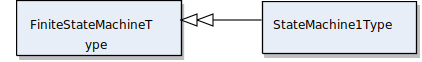 |

###### UML

```xml
<packagedElement xmi:type="uml:StateMachine" xmi:id="_bS7-AAJEEeuH6ovpu80iPw" name="StateMachine1">
  <region xmi:type="uml:Region" xmi:id="_bTdicAJEEeuH6ovpu80iPw" name="Region1"/>
</packagedElement>
```

###### OPC UA

```xml
<UAObjectType BrowseName="StateMachine1Type" NodeId="ns=1;s=StateMachine1Type">
  <DisplayName>StateMachine1Type</DisplayName>
  <References>
    <Reference IsForward="false" ReferenceType="HasSubtype">FiniteStateMachineType</Reference>
  </References>
</UAObjectType>
```


#### UML::State

###### Notes

- 

###### Graphical representation

|                             UML                              |                          OPC UA                           |
| :----------------------------------------------------------: | :-------------------------------------------------------: |
| 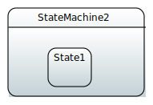 | 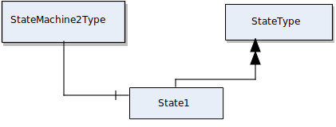 |

###### UML

```xml
<packagedElement xmi:type="uml:StateMachine" xmi:id="_bS7-AAJEEeuH6ovpu80iPw" name="StateMachine2">
  <region xmi:type="uml:Region" xmi:id="_bTdicAJEEeuH6ovpu80iPw" name="Region1">
    <subvertex xmi:type="uml:State" xmi:id="_gwaBgC8hEeuNUsVP4bhZkg" name="State1"/>
  </region>
</packagedElement>
```

###### OPC UA

```xml
<UAObject BrowseName="State1" NodeId="ns=1;s=State1" ParentNodeId="ns=1;s=StateMachine2Type">
  <DisplayName>State1</DisplayName>
  <References>
    <Reference ReferenceType="HasTypeDefinition">StateType</Reference>
    <Reference ReferenceType="HasModellingRule">ModellingRule_Mandatory</Reference>
    <Reference IsForward="false" ReferenceType="HasComponent">ns=1;s=StateMachine2Type</Reference>
  </References>
</UAObject>
<UAObjectType BrowseName="StateMachine2Type" NodeId="ns=1;s=StateMachine2Type">
  <DisplayName>StateMachine2Type</DisplayName>
  <References>
    <Reference IsForward="false" ReferenceType="HasSubtype">FiniteStateMachineType</Reference>
    <Reference ReferenceType="HasComponent">ns=1;s=State1</Reference>
  </References>
</UAObjectType>
```


#### UML::Transition and OPCUA::Event

###### Notes

- If CFG_GENERATE_TRANSITION_EVENTS is enabled, a OPCUA::HasEffect reference to the OPCUA::TransitionEventType will be added for each transition, as illustrated in the example below.
- If no name for the transition is specified, a name of the form SOURCESTATE_to_DESTINATIONSTATE will be generated for the OPCUA::BrowseName, etc.

###### Graphical representation

|                             UML                              |                            OPC UA                            |
| :----------------------------------------------------------: | :----------------------------------------------------------: |
| 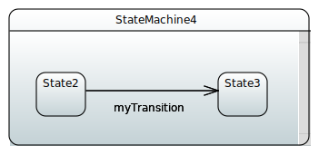 | 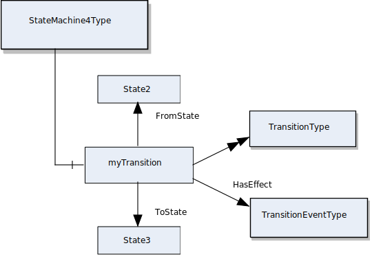 |

###### UML

```xml
<packagedElement xmi:type="uml:StateMachine" xmi:id="_bS7-AAJEEeuH6ovpu80iPw" name="StateMachine4">
  <region xmi:type="uml:Region" xmi:id="_bTdicAJEEeuH6ovpu80iPw" name="Region1">
    <transition xmi:type="uml:Transition" xmi:id="_jLyJkAJEEeuH6ovpu80iPw" name="myTransition" source="_ex5_QAJEEeuH6ovpu80iPw" target="_fvK4wAJEEeuH6ovpu80iPw"/>
    <subvertex xmi:type="uml:State" xmi:id="_ex5_QAJEEeuH6ovpu80iPw" name="State2"/>
    <subvertex xmi:type="uml:State" xmi:id="_fvK4wAJEEeuH6ovpu80iPw" name="State3"/>
  </region>
</packagedElement>
```

###### OPC UA

```xml
<UAObject BrowseName="State3" NodeId="ns=1;s=State3" ParentNodeId="ns=1;s=StateMachine4Type">
  <DisplayName>State3</DisplayName>
  <References>
    <Reference ReferenceType="HasTypeDefinition">StateType</Reference>
    <Reference ReferenceType="HasModellingRule">ModellingRule_Mandatory</Reference>
    <Reference IsForward="false" ReferenceType="HasComponent">ns=1;s=StateMachine4Type</Reference>
  </References>
</UAObject>
<UAObject BrowseName="State2" NodeId="ns=1;s=State2" ParentNodeId="ns=1;s=StateMachine4Type">
  <DisplayName>State2</DisplayName>
  <References>
    <Reference ReferenceType="HasTypeDefinition">StateType</Reference>
    <Reference ReferenceType="HasModellingRule">ModellingRule_Mandatory</Reference>
    <Reference IsForward="false" ReferenceType="HasComponent">ns=1;s=StateMachine4Type</Reference>
  </References>
</UAObject>
<UAObject BrowseName="myTransition" NodeId="ns=1;s=myTransition" ParentNodeId="ns=1;s=StateMachine4Type">
  <DisplayName>myTransition</DisplayName>
  <References>
    <Reference ReferenceType="HasTypeDefinition">TransitionType</Reference>
    <Reference ReferenceType="HasModellingRule">ModellingRule_Mandatory</Reference>
    <Reference IsForward="false" ReferenceType="HasComponent">ns=1;s=StateMachine4Type</Reference>
    <Reference ReferenceType="FromState">ns=1;s=State2</Reference>
    <Reference ReferenceType="ToState">ns=1;s=State3</Reference>
    <Reference ReferenceType="HasEffect">TransitionEventType</Reference>
  </References>
</UAObject>
<UAObjectType BrowseName="StateMachine4Type" NodeId="ns=1;s=StateMachine4Type">
  <DisplayName>StateMachine4Type</DisplayName>
  <References>
    <Reference IsForward="false" ReferenceType="HasSubtype">FiniteStateMachineType</Reference>
    <Reference ReferenceType="HasComponent">ns=1;s=State3</Reference>
    <Reference ReferenceType="HasComponent">ns=1;s=State2</Reference>
    <Reference ReferenceType="HasComponent">ns=1;s=myTransition</Reference>
  </References>
</UAObjectType>
```


#### UML::Pseudostate Initial State

###### Notes

- A UML::Pseudostate is transformed to a OPCUA::InitialState.

###### Graphical representation

|                             UML                              |                            OPC UA                            |
| :----------------------------------------------------------: | :----------------------------------------------------------: |
| 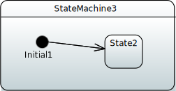 | 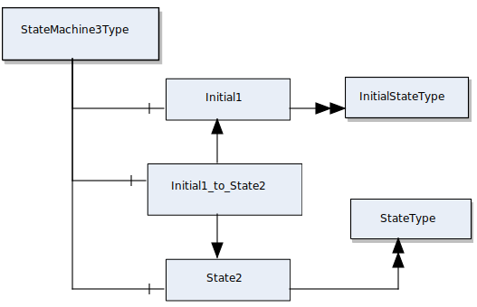 |

###### UML

```xml
<packagedElement xmi:type="uml:StateMachine" xmi:id="_bS7-AAJEEeuH6ovpu80iPw" name="StateMachine3">
  <region xmi:type="uml:Region" xmi:id="_bTdicAJEEeuH6ovpu80iPw" name="Region1">
    <transition xmi:type="uml:Transition" xmi:id="_iOvSgAJEEeuH6ovpu80iPw" source="_dWS84AJEEeuH6ovpu80iPw" target="_ex5_QAJEEeuH6ovpu80iPw"/>
    <subvertex xmi:type="uml:Pseudostate" xmi:id="_dWS84AJEEeuH6ovpu80iPw" name="Initial1"/>
    <subvertex xmi:type="uml:State" xmi:id="_ex5_QAJEEeuH6ovpu80iPw" name="State2"/>
  </region>
</packagedElement>
```

###### OPC UA

```xml
<UAObject BrowseName="Initial1" NodeId="ns=1;s=Initial1" ParentNodeId="ns=1;s=StateMachine3Type">
  <DisplayName>Initial1</DisplayName>
  <References>
    <Reference ReferenceType="HasTypeDefinition">InitialStateType</Reference>
    <Reference ReferenceType="HasModellingRule">ModellingRule_Mandatory</Reference>
    <Reference IsForward="false" ReferenceType="HasComponent">ns=1;s=StateMachine3Type</Reference>
  </References>
</UAObject>
<UAObject BrowseName="State2" NodeId="ns=1;s=State2" ParentNodeId="ns=1;s=StateMachine3Type">
  <DisplayName>State2</DisplayName>
  <References>
    <Reference ReferenceType="HasTypeDefinition">StateType</Reference>
    <Reference ReferenceType="HasModellingRule">ModellingRule_Mandatory</Reference>
    <Reference IsForward="false" ReferenceType="HasComponent">ns=1;s=StateMachine3Type</Reference>
  </References>
</UAObject>
<UAObject BrowseName="Initial1_to_State2" NodeId="ns=1;s=Initial1_to_State2" ParentNodeId="ns=1;s=StateMachine3Type">
  <DisplayName>Initial1_to_State2</DisplayName>
  <References>
    <Reference ReferenceType="HasTypeDefinition">TransitionType</Reference>
    <Reference ReferenceType="HasModellingRule">ModellingRule_Mandatory</Reference>
    <Reference IsForward="false" ReferenceType="HasComponent">ns=1;s=StateMachine3Type</Reference>
    <Reference ReferenceType="FromState">ns=1;s=Initial1</Reference>
    <Reference ReferenceType="ToState">ns=1;s=State2</Reference>
    <Reference ReferenceType="HasEffect">TransitionEventType</Reference>
  </References>
</UAObject>
<UAObjectType BrowseName="StateMachine3Type" NodeId="ns=1;s=StateMachine3Type">
  <DisplayName>StateMachine3Type</DisplayName>
  <References>
    <Reference IsForward="false" ReferenceType="HasSubtype">FiniteStateMachineType</Reference>
    <Reference ReferenceType="HasComponent">ns=1;s=Initial1</Reference>
    <Reference ReferenceType="HasComponent">ns=1;s=State2</Reference>
    <Reference ReferenceType="HasComponent">ns=1;s=Initial1_to_State2</Reference>
  </References>
</UAObjectType>
```


#### Combining classes and state machines

###### Notes

- An OPCUA::StateMachine typically describes the behavior of some OPCUA::Object. Therefore, an OPCUA::StateMachine pretty much always is used as a component of some OPCUA::ObjectType. Although not so common in UML, this can be mimicked by adding a property of the corresponding UML::StateMachine type to the UML::Class.

###### Graphical representation

|                             UML                              |                            OPC UA                            |
| :----------------------------------------------------------: | :----------------------------------------------------------: |
| 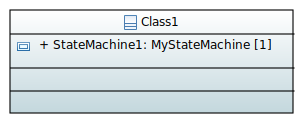<br />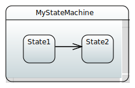 | 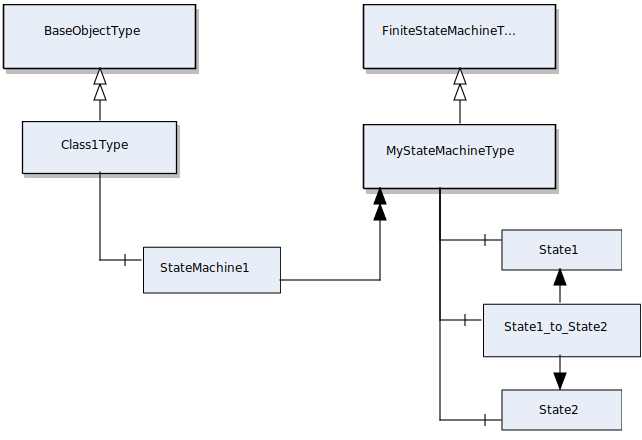 |


#### UML::Transition@guard

###### Notes

- In UML as well as in OPC UA, a transition between two states can only be taken if an associated guard condition evaluates to true. For OPC UA, guards are defined in Specification "OPC Unified Architecture Amendment 2: ChoiceStates and Guards". According to this specification, it is possible to define the condition with or without its semantics in machine-readable form.
- In UML a guard is defined by a UML::Constraint or one of its subtypes. The semantics of an UML::Constraint may be defined via its specification element. The possibilities to specify such a constraint are sheer endless. It may refer to any other element in the model, or even be defined in a programming language like OCL, C, or Java. 

- In OPC UA a guard is represented using an OPCUA::Variable and connected to a OPCUA::StateTransition via a HasGuard reference. The OPCUA::Variable is of type OPCUA::GuardVariableType if no semantics shall be specified. Otherwise, it is of type OPCUA::ExpressionGuardVariableType and the semantics are defined using the Expression property of the OPCUA::ExpressionGuardVariableType. 
- Currently, only Guards without semantics are supported by the transformation.

###### Graphical representation

|                             UML                              |                            OPC UA                            |
| :----------------------------------------------------------: | :----------------------------------------------------------: |
| 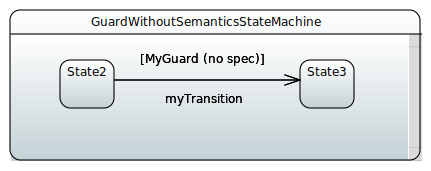 | 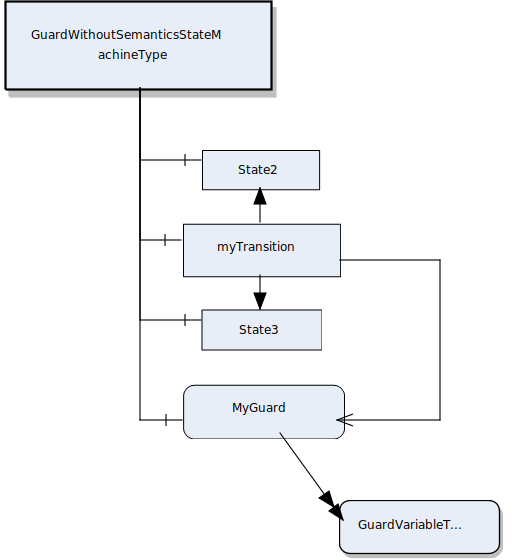 |

###### UML guard without semantics

```xml
<packagedElement xmi:type="uml:StateMachine" xmi:id="_bS7-AAJEEeuH6ovpu80iPw" name="GuardWithoutSemanticsStateMachine">
  <region xmi:type="uml:Region" xmi:id="_bTdicAJEEeuH6ovpu80iPw" name="Region1">
    <transition xmi:type="uml:Transition" xmi:id="_jLyJkAJEEeuH6ovpu80iPw" name="myTransition" guard="_SLg0kC44Eeu-T_1KCZEpkw" source="_ex5_QAJEEeuH6ovpu80iPw" target="_fvK4wAJEEeuH6ovpu80iPw">
      <ownedRule xmi:type="uml:Constraint" xmi:id="_SLg0kC44Eeu-T_1KCZEpkw" name="MyGuard"/>
    </transition>
    <subvertex xmi:type="uml:State" xmi:id="_ex5_QAJEEeuH6ovpu80iPw" name="State2"/>
    <subvertex xmi:type="uml:State" xmi:id="_fvK4wAJEEeuH6ovpu80iPw" name="State3"/>
  </region>
</packagedElement>
```

###### OPC UA guard without semantics

```xml
<UAObject BrowseName="State2" NodeId="ns=1;s=State2" ParentNodeId="ns=1;s=GuardWithoutSemanticsStateMachineType">
  <DisplayName>State2</DisplayName>
  <References>
    <Reference ReferenceType="HasTypeDefinition">StateType</Reference>
    <Reference ReferenceType="HasModellingRule">ModellingRule_Mandatory</Reference>
    <Reference IsForward="false" ReferenceType="HasComponent">ns=1;s=GuardWithoutSemanticsStateMachineType</Reference>
  </References>
</UAObject>
<UAObject BrowseName="State3" NodeId="ns=1;s=State3" ParentNodeId="ns=1;s=GuardWithoutSemanticsStateMachineType">
  <DisplayName>State3</DisplayName>
  <References>
    <Reference ReferenceType="HasTypeDefinition">StateType</Reference>
    <Reference ReferenceType="HasModellingRule">ModellingRule_Mandatory</Reference>
    <Reference IsForward="false" ReferenceType="HasComponent">ns=1;s=GuardWithoutSemanticsStateMachineType</Reference>
  </References>
</UAObject>
<UAVariable BrowseName="MyGuard" NodeId="ns=1;s=MyGuard" ParentNodeId="ns=1;s=GuardWithoutSemanticsStateMachineType" DataType="LocalizedText">
  <DisplayName>MyGuard</DisplayName>
  <References>
    <Reference IsForward="false" ReferenceType="HasComponent">ns=1;s=GuardWithoutSemanticsStateMachineType</Reference>
    <Reference IsForward="false" ReferenceType="HasGuard">ns=1;s=myTransition</Reference>
    <Reference ReferenceType="HasModellingRule">ModellingRule_Mandatory</Reference>
    <Reference ReferenceType="HasTypeDefinition">GuardVariableType</Reference>
  </References>
</UAVariable>
<UAObject BrowseName="myTransition" NodeId="ns=1;s=myTransition" ParentNodeId="ns=1;s=GuardWithoutSemanticsStateMachineType">
  <DisplayName>myTransition</DisplayName>
  <References>
    <Reference ReferenceType="HasTypeDefinition">TransitionType</Reference>
    <Reference ReferenceType="HasModellingRule">ModellingRule_Mandatory</Reference>
    <Reference IsForward="false" ReferenceType="HasComponent">ns=1;s=GuardWithoutSemanticsStateMachineType</Reference>
    <Reference ReferenceType="FromState">ns=1;s=State2</Reference>
    <Reference ReferenceType="ToState">ns=1;s=State3</Reference>
    <Reference ReferenceType="HasEffect">TransitionEventType</Reference>
    <Reference ReferenceType="HasGuard">ns=1;s=MyGuard</Reference>
  </References>
</UAObject>
<UAObjectType BrowseName="GuardWithoutSemanticsStateMachineType" NodeId="ns=1;s=GuardWithoutSemanticsStateMachineType">
  <DisplayName>GuardWithoutSemanticsStateMachineType</DisplayName>
  <References>
    <Reference IsForward="false" ReferenceType="HasSubtype">FiniteStateMachineType</Reference>
    <Reference ReferenceType="HasComponent">ns=1;s=State3</Reference>
    <Reference ReferenceType="HasComponent">ns=1;s=State2</Reference>
    <Reference ReferenceType="HasComponent">ns=1;s=myTransition</Reference>
    <Reference ReferenceType="HasComponent">ns=1;s=MyGuard</Reference>
  </References>
</UAObjectType>
```

