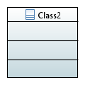

# UML to OPC UA Model Transformation Rules

## QVTo configuration options

Configuration options can be set via the file transforms/Common/Configuration.qvto.

| Parameter              | Type    | Description                                                  |
| ---------------------- | ------- | ------------------------------------------------------------ |
| CFG_ENABLE_ALIAS_TABLE | Boolean | Enable/Disable creation of the OPCUA::AliasTable             |
| CFG_USE_BLACKBOX       | Boolean | Enable/Disable use of the QVTo Blackbox. The Blackbox allows to read NodeIds from a NodeId CSV file instead of defining them statically as part of the transformation. |
|                        |         |                                                              |

## General information about the transformation rules

#### Namespace management

Any UML::Element has to be assigned to a namespace in OPC UA by the transformation process. This is absolutely mandatory, as OPC UA elements cannot exist without a namespace. Namespaces in an OPC UA information model are organized using the OPCUA::UANodeSet::NamespaceUris table. 

Namespace 0 is reserved for the OPC UA Base Information Model. Thus, the first entry in the OPCUA::UANodeSet::NamespaceUris table has the namespace index 1. The namespace with index 1 is also referred to as default namespace.

Any UML::Element can be assigned to a namespace by placing it in a UML::Package. If a UML::Element is not placed in a UML::Package, the default namespace will be used.

###### Namespace definition using packages

UML::Packages can be used to define the Namespace of multiple UML elements.

The UML::Package::URI will be used as namespace. If no UML::Package::URI is defined, the Package::name will be used instead.

###### Default namespace

If the UML::Element is not part of a UML::Package, the UML::Model::URI is used as default namespace. 

If no UML::Model::URI is specified, the UML::Model::name will be used instead.

If no UML::Model::name is specified, the transformation process will throw and exception and terminate.

#### OPCUA::NamespaceUris

An OPCUA:NamespaceUris table is generated automatically for all namespaces that are used by the OPC UA model.

#### OPCUA::AliasTable

The OPCUA::AliasTable allows to use human-readable identifiers in the Nodeset file, e.g., BaseObjectType instead of i=58. If CFG_ENABLE_ALIAS_TABLE = true, the human-readable format will be used where possible. This results in a larger Nodeset file.

#### OPCUA::NodeId format

The transformation currently generates String NodeIds of the Format "ns=NAMESPACE_INDEX;s=IDENTIFIER".

#### OPCUA::Browsename, OPCUA::Displayname

The Browsename is always equal to the Displayname. 

## Class diagram transformation rules

#### Basic example: Robots class diagram

###### UML


###### OPC UA


#### Quick reference

| UML  | OPC UA |
| ---- | ------ |
|      |        |
|      |        |
|      |        |
|      |        |


#### UML::Class

"Type" is appended to Class.name and used as OPCUA::Browsename, OPCUA::Displayname, and IDENTIFIER for the NodeId.

BaseObjectType is used as a supertype, if no other supertype is specified for the class.

###### UML

```xml
<packagedElement xmi:type="uml:Robot" xmi:id="_punesMdPEeqBwPQ5-6UCwg" name="Robot"/>
```

###### OPC UA

```xml
  <set:UAObjectType BrowseName="RobotType" NodeId="ns=1;s=RobotType">
    <set:DisplayName>RobotType</set:DisplayName>
    <set:References>
      <set:Reference IsForward="false" ReferenceType="HasSubtype">BaseObjectType</set:Reference>
    </set:References>
  </set:UAObjectType>
```

###### Graphical representation



### UML::

## State machine diagram transformation rules

### Quick reference

| UML               | OPC UA                                                       |
| ----------------- | ------------------------------------------------------------ |
| UML::StateMachine | ObjectType which is Subtype of StateMachineType, the parent type shall be referenced via class diagram |
| UML::Region       | No equivalent.                                               |
| UML::Pseudostate  | OPCUA::InitialStateType                                      |
| UML::State        | OPCUA::StateType                                             |
| UML::Transition   | OPCUA::StateTransitionType                                   |
| ...               | ...                                                          |

### UML::StateMachine

### UML::Region

### UML::Pseudostate

### UML::State

### UML::Transition

